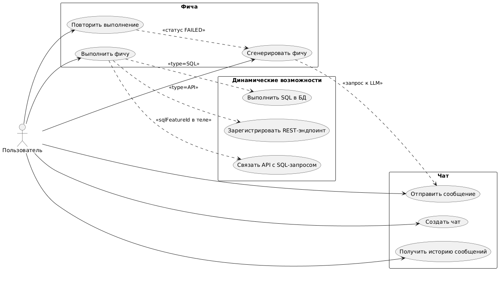

# Smart Backend

Бэкенд-конструктор с поддержкой ИИ: позволяет в режиме диалога с локальной нейросетью динамически создавать SQL-запросы и REST API-эндпоинты без перезапуска приложения.

## Запуск

```bash
docker compose up -d
mvn spring-boot:run
```

---

## Postman-коллекция

В корне репозитория находится файл `postman.json` с готовыми запросами для всех эндпоинтов.
C ее помощью можно пройти сценарии 1 и 3 из описания ниже
---

## Диаграмма вариантов использования

---
## Сценарии использования

### Сценарий 1 — Создание SQL-фичи (таблица + данные)

1. `POST /chats` — создать чат
2. `POST /chats/{id}/messages` — описать задачу, например: _"Создай таблицу users с полями id, login, email"_
3. `POST /chats/{id}/features/generate?type=SQL` — LLM возвращает SQL CREATE TABLE, сохраняется как фича в статусе `DRAFT`
4. `POST /chats/features/{id}/execute` — SQL выполняется в схеме `generated` БД, статус → `EXECUTED`

Если выполнение завершилось ошибкой (статус `FAILED`):

5. `POST /chats/features/{id}/retry` — ошибка отправляется обратно в LLM, получается исправленный SQL, статус снова → `DRAFT`
6. `POST /chats/features/{id}/execute` — повторное выполнение

---

### Сценарий 2 — Создание динамического REST API

1. `POST /chats` — создать чат
2. `POST /chats/{id}/messages` — описать эндпоинт, например: _"GET /api/users, параметры: page, limit, возвращает: login, email"_
3. `POST /chats/{id}/features/generate?type=API` — LLM возвращает конфигурацию эндпоинта, сохраняется как фича в статусе `DRAFT`
4. `POST /chats/features/{id}/execute` — эндпоинт регистрируется в Spring через `RequestMappingHandlerMapping`, статус → `EXECUTED`

---

### Сценарий 3 — Связка API + SQL

1. Выполнить Сценарий 1 (получить SQL-фичу в статусе `EXECUTED`, id=5)
2. Выполнить шаги 1–3 Сценария 2 (получить API-фичу в статусе `DRAFT`, id=7)
3. `POST /chats/features/7/execute` с телом `{ "sqlFeatureId": 5 }` — API-эндпоинт связывается с SQL-запросом: при обращении к эндпоинту выполняется SELECT и результат возвращается клиенту

---

## API

### Чаты

#### Создать чат

```
POST /chats
Content-Type: application/json

{
  "title": "Создание модуля пользователей"
}
```

Ответ `200`:
```json
{
  "id": 1,
  "title": "Создание модуля пользователей"
}
```

---

#### Отправить сообщение

Сообщение пользователя сохраняется в БД, отправляется в LLM вместе со всей историей чата. Ответ ассистента также сохраняется.

```
POST /chats/{chatId}/messages
Content-Type: application/json

{
  "content": "Создай таблицу products с полями id, name, price"
}
```

Ответ `200`:
```json
{
  "content": "```json\n{\"code\": \"CREATE TABLE generated.products ...\", \"language\": \"sql\", ...}\n```"
}
```

---

#### Получить историю сообщений

```
GET /chats/{chatId}/messages
```

Ответ `200`:
```json
[
  {
    "id": 1,
    "role": "USER",
    "content": "Создай таблицу products ...",
    "createdAt": "2026-06-09T10:00:00"
  },
  {
    "id": 2,
    "role": "ASSISTANT",
    "content": "...",
    "createdAt": "2026-06-09T10:00:05"
  }
]
```

---

### Фичи

#### Сгенерировать фичу

Берёт последний ответ LLM из чата, парсит JSON, сохраняет фичу в статусе `DRAFT`.

> Конфликт: если в чате уже есть фича в статусе `DRAFT` — вернёт `409 Conflict`.

```
POST /chats/{chatId}/features/generate?type=SQL
POST /chats/{chatId}/features/generate?type=API
```

Ответ `200`:
```json
{
  "id": 3,
  "type": "SQL",
  "description": "Create products table",
  "content": "CREATE TABLE generated.products (id SERIAL PRIMARY KEY, name VARCHAR(255), price NUMERIC);",
  "status": "DRAFT",
  "parameters": [],
  "results": [],
  "errorMessage": null
}
```
---

#### Выполнить фичу

Только фичи в статусе `DRAFT`.

**SQL-фича** — выполняет SQL через `NamedParameterJdbcTemplate` в схеме `generated`.

```
POST /chats/features/{featureId}/execute
Content-Type: application/json

{
  "param1": "value1"
}
```
Динамически созданные таблицы размещаются в отдельной схеме `generated`.

**API-фича** — регистрирует динамический HTTP-эндпоинт. Опционально можно связать с SQL-фичей:

```
POST /chats/features/{featureId}/execute
Content-Type: application/json

{
  "sqlFeatureId": 5
}
```

Ответ `200` при успехе:
```json
{
  "id": 3,
  "status": "EXECUTED",
  ...
}
```

Ответ `200` при ошибке выполнения (статус меняется на `FAILED`):
```json
{
  "id": 3,
  "status": "FAILED",
  "errorMessage": "ERROR: relation \"generated.products\" already exists",
  ...
}
```

---

#### Повторить выполнение фичи

Только фичи в статусе `FAILED`. Отправляет текст ошибки обратно в LLM с просьбой исправить, сохраняет новый вариант в статусе `DRAFT`.

```
POST /chats/features/{featureId}/retry
```

Ответ `200`:
```json
{
  "id": 3,
  "status": "DRAFT",
  "content": "CREATE TABLE IF NOT EXISTS generated.products ...",
  "errorMessage": null,
  ...
}
```

---

## Статусы фичи

- **DRAFT** — фича создана (или восстановлена после ошибки) и готова к выполнению.
- **EXECUTED** — фича выполнена успешно; SQL применён к БД или REST-эндпоинт зарегистрирован.
- **FAILED** — выполнение завершилось с ошибкой; текст ошибки сохранён в `errorMessage`. Доступна повторная попытка через `retry()`.

---

## Коды ошибок

| HTTP | Условие |
|---|---|
| `400 Bad Request` | Пустое тело запроса, несовпадение типа фичи |
| `404 Not Found` | Чат или фича не найдены |
| `409 Conflict` | В чате уже есть фича в статусе DRAFT |